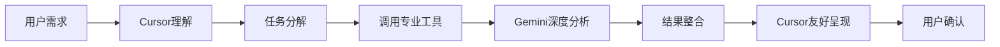

# 🤖➡️🤖 AI终端调用AI工具优化指南

## 🎯 核心设计原则

### 1. 分工明确，避免重复
- **Cursor AI**: 交互理解 + 上下文分析 + 任务协调
- **Gemini AI**: 专业分析 + 深度处理 + 领域专精

### 2. 最佳协作模式



## 🚀 优化配置建议

### MCP工具调用策略

1. **智能分工调用**
   ```javascript
   // Cursor应该这样调用我们的AI工具
   if (task.type === 'code_analysis') {
     // 使用Gemini的专业代码审查
     result = await callMCP('code_review', {
       code: selectedCode,
       language: detectedLanguage,
       focus: 'performance'
     });
   }
   ```

2. **避免重复处理**
   - Cursor: 负责理解用户意图
   - Gemini: 负责专业技术分析
   - 结果: Cursor整合展示

## 🎭 角色定位

### Cursor AI终端 🎯
- ✅ 自然语言理解
- ✅ 上下文管理
- ✅ 任务规划分解
- ✅ 结果整合呈现
- ✅ 用户交互体验

### Gemini AI工具 🤖
- ✅ 代码深度分析
- ✅ 大规模文档生成
- ✅ 专业领域评估
- ✅ 安全性检查
- ✅ 性能优化建议

## 💡 实用建议

### 针对用户的使用技巧

1. **明确指令**
   ```
   ❌ "帮我改进代码"
   ✅ "用专业工具分析这段代码的性能问题"
   ```

2. **分步骤操作**
   ```
   Step1: 让Cursor理解需求和上下文
   Step2: 调用Gemini专业分析
   Step3: 让Cursor整合结果并执行
   ```

3. **充分利用各自优势**
   - 复杂技术问题 → 交给Gemini深度分析
   - 代码修改和实现 → 让Cursor基于分析结果执行
   - 用户沟通和解释 → Cursor的自然语言优势

## 🔧 技术实现优化

### 减少冲突的配置

1. **工具命名明确化**
   ```json
   {
     "tools": [
       {
         "name": "gemini_code_analysis",
         "description": "专业代码深度分析工具"
       },
       {
         "name": "gemini_document_generator", 
         "description": "大规模技术文档生成"
       }
     ]
   }
   ```

2. **调用策略优化**
   - 让Cursor智能选择何时调用专业工具
   - 避免简单问题调用复杂工具
   - 确保工具输出格式便于Cursor理解

## 🎯 成功指标

- ✅ 用户体验流畅自然
- ✅ 避免AI之间的功能重复
- ✅ 发挥各AI的专业优势
- ✅ 减少响应时间和资源消耗
- ✅ 提供更准确的专业建议